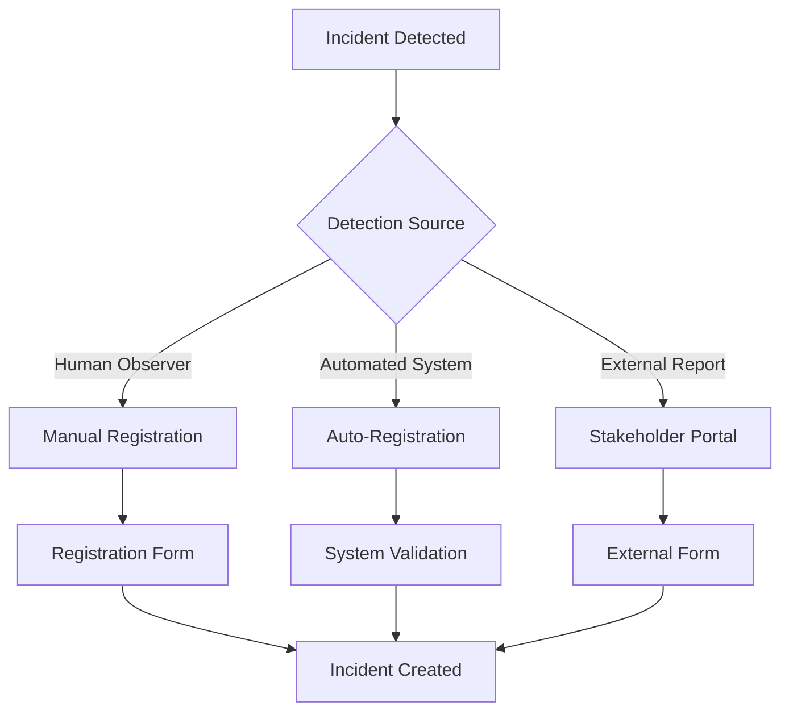

# Incident Registration - User Workflows and Integration Points

## 🚨 **Multi-Channel Incident Registration**

### **1. Primary Registration Interfaces**

#### **A. BCMS Dashboard - Quick Incident Declaration**
```javascript
// Main dashboard with prominent "DECLARE INCIDENT" button
<div className="emergency-actions-panel">
  <button className="declare-incident-btn critical-pulse">
    🚨 DECLARE INCIDENT
  </button>
  <div className="quick-actions">
    <button>📞 Emergency Contact</button>
    <button>📋 Check Status</button>
    <button>🎯 Response Teams</button>
  </div>
</div>
```

#### **B. Dedicated Incident Registration Portal**
- **URL**: `https://bcms.company.com/incident/declare`
- **Mobile-Optimized**: Accessible from any device during crisis
- **Guest Access**: External stakeholders can report incidents
- **Multi-Language**: Support for global operations

#### **C. Mobile Emergency App**
- **One-Touch Declaration**: Large emergency button on home screen
- **Location Services**: Auto-capture incident location
- **Photo/Video**: Evidence capture during incident reporting
- **Offline Mode**: Queue incidents when network unavailable

### **2. Automated Detection and Registration**

#### **A. System Integration Triggers**
```sql
-- Automated incident creation from monitoring systems
INSERT INTO incident_management_log (
    organization_id, incident_number, incident_title, 
    incident_type_id, initial_severity, current_severity,
    detected_at, declared_at, source
) VALUES (
    @org_id, 
    generate_incident_number(),
    'Automated Detection: ' || @alert_description,
    @incident_type_id,
    map_alert_severity(@alert_level),
    map_alert_severity(@alert_level),
    @alert_timestamp,
    CURRENT_TIMESTAMP,
    'automated_monitoring'
);
```

#### **B. Integration Points**
- **Security Systems**: SIEM, intrusion detection, firewall alerts
- **Monitoring Tools**: Nagios, Datadog, New Relic, custom dashboards
- **Business Systems**: ERP failure alerts, payment system issues
- **IoT Sensors**: Fire alarms, flood sensors, facility monitoring
- **Communication Systems**: Mass notification system triggers

### **3. Communication-Based Registration**

#### **A. Email-to-Incident**
```
To: incidents@company.com
Subject: [CRITICAL] Data Center Power Failure
Body: Automatic incident creation with email parsing
```

#### **B. Phone/SMS Registration**
- **Emergency Hotline**: +1-800-BCMS-911
- **SMS Keywords**: Text "INCIDENT" to shortcode
- **Voice-to-Text**: Automated transcription and incident creation
- **Multi-Language Support**: 24/7 operator assistance

#### **C. Chat/Teams Integration**
```javascript
// Microsoft Teams/Slack bot commands
/incident declare severity=critical title="Network Outage" 
/incident status INC-2024-001
/incident assign @crisis-team
```

## 📋 **Incident Registration Workflow**

### **Step 1: Initial Detection/Report**


### **Step 2: Incident Registration Form**
```html
<!-- Dynamic incident registration form -->
<form class="incident-registration-form">
  <!-- Basic Information -->
  <section class="form-section critical">
    <h3>🚨 Critical Information</h3>
    <div class="form-group">
      <label>Incident Title*</label>
      <input type="text" placeholder="Brief, descriptive title" required>
    </div>
    
    <div class="form-group">
      <label>Incident Type*</label>
      <select required>
        <option value="">Select incident type...</option>
        <option value="CYBER">Cyber Security</option>
        <option value="NATURAL">Natural Disaster</option>
        <option value="OPERATIONAL">Operational Failure</option>
        <option value="PANDEMIC">Health Emergency</option>
        <option value="SUPPLIER">Supply Chain</option>
      </select>
    </div>
    
    <div class="form-group">
      <label>Severity Level*</label>
      <div class="severity-selector">
        <input type="radio" id="critical" name="severity" value="critical">
        <label for="critical" class="severity-critical">Critical</label>
        
        <input type="radio" id="high" name="severity" value="high">
        <label for="high" class="severity-high">High</label>
        
        <input type="radio" id="medium" name="severity" value="medium">
        <label for="medium" class="severity-medium">Medium</label>
        
        <input type="radio" id="low" name="severity" value="low">
        <label for="low" class="severity-low">Low</label>
      </div>
    </div>
  </section>

  <!-- Detailed Information -->
  <section class="form-section">
    <h3>📝 Incident Details</h3>
    <div class="form-group">
      <label>Description*</label>
      <textarea placeholder="Detailed description of what happened, when, and current impact" required></textarea>
    </div>
    
    <div class="form-group">
      <label>Affected Systems/Processes</label>
      <div class="checkbox-group" id="affected-systems">
        <!-- Dynamically populated from BIA processes -->
      </div>
    </div>
    
    <div class="form-group">
      <label>Affected Locations</label>
      <div class="checkbox-group" id="affected-locations">
        <!-- Dynamically populated from organization locations -->
      </div>
    </div>
  </section>

  <!-- Impact Assessment -->
  <section class="form-section">
    <h3>📊 Impact Assessment</h3>
    <div class="form-group">
      <label>Estimated Financial Impact</label>
      <select>
        <option value="">Unknown</option>
        <option value="<10000">Less than £10,000</option>
        <option value="10000-50000">£10,000 - £50,000</option>
        <option value="50000-250000">£50,000 - £250,000</option>
        <option value="250000-1000000">£250,000 - £1,000,000</option>
        <option value=">1000000">Over £1,000,000</option>
      </select>
    </div>
    
    <div class="form-group">
      <label>Customer Impact</label>
      <div class="radio-group">
        <input type="radio" name="customer_impact" value="none">
        <label>No customer impact</label>
        
        <input type="radio" name="customer_impact" value="minor">
        <label>Minor service degradation</label>
        
        <input type="radio" name="customer_impact" value="major">
        <label>Major service disruption</label>
        
        <input type="radio" name="customer_impact" value="complete">
        <label>Complete service outage</label>
      </div>
    </div>
  </section>

  <!-- Immediate Actions -->
  <section class="form-section">
    <h3>⚡ Immediate Actions Required</h3>
    <div class="checkbox-group">
      <input type="checkbox" id="activate-crisis-team">
      <label for="activate-crisis-team">🎯 Activate Crisis Team</label>
      
      <input type="checkbox" id="notify-executives">
      <label for="notify-executives">📞 Notify Executive Team</label>
      
      <input type="checkbox" id="customer-communication">
      <label for="customer-communication">📢 Customer Communication Required</label>
      
      <input type="checkbox" id="media-attention">
      <label for="media-attention">📺 Media Attention Expected</label>
      
      <input type="checkbox" id="regulatory-notification">
      <label for="regulatory-notification">🏛️ Regulatory Notification Required</label>
      
      <input type="checkbox" id="external-assistance">
      <label for="external-assistance">🚑 External Emergency Services</label>
    </div>
  </section>

  <!-- Reporter Information -->
  <section class="form-section">
    <h3>👤 Reporter Information</h3>
    <div class="form-group">
      <label>Your Name*</label>
      <input type="text" value="[Auto-populated from login]" required>
    </div>
    
    <div class="form-group">
      <label>Contact Number*</label>
      <input type="tel" placeholder="Emergency contact number" required>
    </div>
    
    <div class="form-group">
      <label>Current Location</label>
      <input type="text" placeholder="Where are you currently located?">
    </div>
  </section>

  <!-- Evidence and Attachments -->
  <section class="form-section">
    <h3>📎 Evidence & Attachments</h3>
    <div class="file-upload-area">
      <input type="file" id="evidence" multiple accept="image/*,video/*,.pdf,.doc,.docx">
      <label for="evidence">
        📱 Upload Photos, Videos, or Documents
        <span>Drag & drop or click to select</span>
      </label>
    </div>
  </section>

  <!-- Action Buttons -->
  <div class="form-actions">
    <button type="button" class="btn-secondary">💾 Save Draft</button>
    <button type="submit" class="btn-primary critical-pulse">
      🚨 DECLARE INCIDENT
    </button>
  </div>
</form>
```

### **Step 3: Auto-Population and Intelligence**
```javascript
// Smart form enhancement
const enhanceIncidentForm = {
  
  // Auto-populate based on user context
  autoPopulateContext: () => {
    if (user.currentLocation) form.location = user.currentLocation;
    if (user.department) form.affectedSystems = getRelevantSystems(user.department);
    if (timeOfDay === 'business_hours') form.priority += 1;
  },

  // Risk scenario matching
  suggestRiskScenarios: (incidentDescription) => {
    const matchingRisks = riskRegister.filter(risk => 
      similarity(risk.scenario, incidentDescription) > 0.7
    );
    return matchingRisks.map(risk => ({
      riskId: risk.id,
      scenario: risk.title,
      suggestedSeverity: risk.impactLevel,
      suggestedProcedures: risk.treatmentProcedures
    }));
  },

  // Procedure recommendation
  recommendProcedures: (incidentType, severity) => {
    return responseProcedures.filter(proc => 
      proc.incidentTypes.includes(incidentType) &&
      proc.severityLevels.includes(severity)
    );
  },

  // Team suggestion
  suggestTeamMembers: (incidentType, location, timeOfDay) => {
    return contactDirectory.filter(person => 
      person.competencies.includes(incidentType) &&
      person.availability[timeOfDay] === 'available' &&
      person.location === location
    ).sort((a, b) => b.experienceScore - a.experienceScore);
  }
};
```

## 🔗 **Integration with BCMS Modules**

### **1. Automatic Module Activation**
```javascript
// Post-incident registration workflow
const postRegistrationWorkflow = async (incidentId) => {
  
  // 1. Activate Response Procedures
  const recommendedProcedures = await getRecommendedProcedures(incident);
  for (const procedure of recommendedProcedures) {
    await activateResponseProcedure(incidentId, procedure.id);
  }

  // 2. Create Recovery Options Assessment
  const recoveryOptions = await assessRecoveryOptions(incident);
  await createRecoveryPlan(incidentId, recoveryOptions);

  // 3. Update Risk Register
  await updateRiskRegister(incident.triggeredRisks, {
    actualOccurrence: true,
    actualImpact: incident.estimatedImpact,
    actualTimestamp: incident.declaredAt
  });

  // 4. Activate Treatment Plans
  const relevantTreatments = await getRelevantTreatments(incident);
  for (const treatment of relevantTreatments) {
    await activateTreatmentPlan(treatment.id, incidentId);
  }

  // 5. Generate Initial Documentation
  await generateIncidentDocumentation(incidentId, {
    initialReport: true,
    stakeholderNotifications: true,
    complianceReports: incident.regulatoryReportingRequired
  });
};
```

### **2. Real-Time Validation**
```javascript
// Form validation with BCMS intelligence
const validateIncidentRegistration = {
  
  // Check against active incidents
  checkForDuplicates: (title, description, location) => {
    const activeIncidents = getActiveIncidents();
    const similarity = calculateSimilarity(title, description, location);
    if (similarity > 0.8) {
      return {
        isDuplicate: true,
        existingIncident: similarity.incident,
        recommendation: 'Consider updating existing incident instead'
      };
    }
  },

  // Validate severity against impact
  validateSeverity: (severity, estimatedImpact, affectedSystems) => {
    const criticalSystems = affectedSystems.filter(s => s.criticality === 'critical');
    if (criticalSystems.length > 0 && severity < 'high') {
      return {
        isValid: false,
        recommendation: 'Consider higher severity due to critical system impact'
      };
    }
  },

  // Check resource availability
  checkResourceAvailability: (requiredTeams, timeOfDay) => {
    const availability = getTeamAvailability(requiredTeams, timeOfDay);
    return {
      available: availability.filter(t => t.status === 'available'),
      unavailable: availability.filter(t => t.status !== 'available'),
      recommendations: getAlternativeTeamMembers(availability.unavailable)
    };
  }
};
```

## 📱 **User Access Points by Role**

### **1. Executive Users**
- **Dashboard Widget**: "Declare Major Incident" with executive escalation
- **Mobile App**: Executive incident declaration with board notification
- **Email Interface**: Forward critical emails to incidents@company.com
- **Phone Access**: Direct line to crisis team with incident logging

### **2. Operations Staff**
- **System Dashboards**: "Report Incident" buttons on all monitoring screens
- **Mobile Notifications**: Push notification with "Declare Incident" action
- **Slack/Teams**: Bot commands for quick incident declaration
- **Help Desk Integration**: Escalate tickets to incidents with one click

### **3. General Employees**
- **Intranet Portal**: Prominent incident reporting link
- **Mobile App**: Employee safety and incident reporting
- **Email Reporting**: Simple email-to-incident creation
- **Anonymous Reporting**: Option for sensitive incidents

### **4. External Stakeholders**
- **Customer Portal**: Service issue reporting that can escalate to incidents
- **Supplier Interface**: Supply chain disruption reporting
- **Public Portal**: Community impact reporting for public-facing incidents
- **Partner Access**: B2B incident coordination and notification

## 🚀 **Advanced Features**

### **1. Smart Incident Classification**
```javascript
// AI-powered incident analysis
const incidentIntelligence = {
  
  // Analyze description for automatic classification
  analyzeDescription: (description) => {
    const keywordMatches = {
      cyber: ['malware', 'breach', 'hack', 'phishing', 'ransomware'],
      operational: ['outage', 'failure', 'down', 'error', 'crash'],
      natural: ['flood', 'fire', 'earthquake', 'storm', 'hurricane'],
      pandemic: ['illness', 'quarantine', 'health', 'sick', 'outbreak']
    };
    
    return Object.entries(keywordMatches).map(([type, keywords]) => ({
      type,
      confidence: calculateKeywordConfidence(description, keywords),
      suggestedSeverity: inferSeverityFromKeywords(description, keywords)
    })).sort((a, b) => b.confidence - a.confidence);
  },

  // Historical pattern matching
  matchHistoricalPatterns: (incident) => {
    const similarIncidents = findSimilarIncidents(incident, {
      timeframe: '2 years',
      similarityThreshold: 0.6
    });
    
    return {
      patterns: similarIncidents,
      avgDuration: calculateAverageDuration(similarIncidents),
      commonCauses: extractCommonCauses(similarIncidents),
      effectiveProcedures: getEffectiveProcedures(similarIncidents)
    };
  }
};
```

### **2. Mobile-First Registration**
```javascript
// Progressive Web App for incident registration
const mobileFeatures = {
  
  // Location services
  captureLocation: () => {
    navigator.geolocation.getCurrentPosition(position => {
      form.location = {
        lat: position.coords.latitude,
        lng: position.coords.longitude,
        accuracy: position.coords.accuracy
      };
    });
  },

  // Camera integration
  captureEvidence: () => {
    navigator.mediaDevices.getUserMedia({ video: true, audio: true })
      .then(stream => {
        // Real-time video/photo capture during incident reporting
        recordEvidence(stream);
      });
  },

  // Voice-to-text
  voiceDescription: () => {
    const recognition = new webkitSpeechRecognition();
    recognition.onresult = (event) => {
      form.description += event.results[0][0].transcript;
    };
    recognition.start();
  },

  // Offline support
  offlineStorage: () => {
    // Store incident data locally if network unavailable
    localStorage.setItem('pendingIncident', JSON.stringify(form));
    // Sync when connection restored
    window.addEventListener('online', syncPendingIncidents);
  }
};
```

## 📊 **Registration Entry Points Summary**

| User Type | Primary Method | Secondary Methods | Key Features |
|-----------|---------------|-------------------|--------------|
| **Executives** | Dashboard Widget | Mobile App, Phone | Board notification, High-level view |
| **Operations** | System Dashboards | Chat Bots, Mobile | Monitor integration, Quick escalation |
| **Employees** | Intranet Portal | Mobile App, Email | Simple interface, Anonymous option |
| **External** | Customer Portal | Public Portal, Phone | Guest access, Multi-language |
| **Automated** | API Integration | Webhooks, Alerts | System triggers, AI classification |

This comprehensive incident registration system ensures that incidents can be reported quickly and efficiently from multiple channels, with intelligent form assistance and seamless integration into the broader BCMS ecosystem. The key is making it **fast**, **accessible**, and **intelligent** so that during crisis situations, users can focus on response rather than complex data entry.
