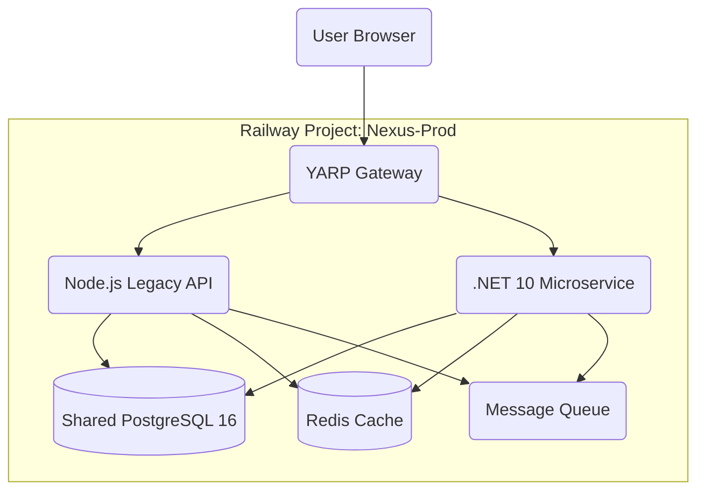

# Nexus BCMS - Target Enterprise Architecture (v1.2)

## Hybrid Intelligence Architecture (React + .NET 10)

**Document Reference:** NEXUS-BCMS-ARCH-002-TARGET
**Version:** 1.2
**Status:** Architecture Decision Record (ADR)
**Base References:**

- `Architecture.md` (Functional Source of Truth)
- `Current Codebase` (React/Node.js Baseline)

---

## 1. Executive Summary & Strategy

### 1.1 The Hybrid Strategy

We are adopting a **Hybrid Strangler Architecture** to combine the agility of our existing frontend with the enterprise power of .NET 10.

- **Keep**: The **React/Vite Frontend**. It is mature, aesthetic, and fully functional. Rewriting this in Blazor offers low ROI.
- **Migrate**: The **Backend Logic** for compute-heavy domains (BIA, Graphs, Risk). These will move from Node.js to **.NET 10 Microservices** to leverage Dapper's raw SQL performance.
- **Bridge**: An API Gateway (YARP) will seamlessly route traffic between the legacy Node.js API (CRUD) and the new .NET Services (Compute).

### 1.2 Development Methodology: Strict TDD

All new .NET development **MUST** follow Test-Driven Development (TDD).

1.  **Red**: Write a failing Unit Test for the business logic (e.g., `CalculateRTOImpact()`).
2.  **Green**: Write the minimal C# code to pass the test.
3.  **Refactor**: Optimize (e.g., implement Dapper CTEs) while keeping the test green.

**Coverage Target:** 100% Core Domain Logic Coverage.

---

## 2. Functional Architecture Map (Hybrid Model)

| Module              | Current State (React + Node) | Target State (React + .NET 10) | Implementation Strategy                                                 |
| :------------------ | :--------------------------- | :----------------------------- | :---------------------------------------------------------------------- |
| **Frontend UI**     | React / Radix UI / Recharts  | **Unchanged (React)**          | **RETAIN**: The UI remains exactly as is. API calls are just re-routed. |
| **Dashboard**       | Node.js Aggregation          | **.NET Read Service**          | **MIGRATE**: Dapper Materialized Views for <50ms load times.            |
| **BIA Engine**      | Node.js Runtime Calc         | **.NET Domain Service**        | **MIGRATE**: Type-safe C# logic for accurate impact scoring.            |
| **Resource Map**    | Prisma Recursive Queries     | **.NET Graph Service**         | **MIGRATE**: Dapper CTEs for deep dependency tree traversal.            |
| **Cruft (HR/Docs)** | Node.js CRUD                 | **Node.js (Legacy)**           | **DEFER**: Keep in Node.js until Phase 3 to save effort.                |

---

## 3. Technical Stack Specifications (Hybrid)

### 3.1 Core Technologies

- **Frontend**: React 18 + Vite + TypeScript (Existing)
- **API Gateway**: YARP (.NET 8 Reverse Proxy)
- **High-Performance Backend**: .NET 10 (Native AOT) + C# 13
- **Legacy Backend**: Node.js + Express (Maintenance Mode)
- **Data Access**: **Dapper** (Complex Queries) & **Prisma** (Simple CRUD)
- **Database**: PostgreSQL 16+ (Shared Database, RLS Enforced)

### 3.2 TDD Workflow for Migration

When porting a feature (e.g., Dependency Graph):

1.  **Define Spec**: Create `DependencyGraphTests.cs` using xUnit + FluentAssertions.
2.  **Mock Data**: Use ephemeral PostgreSQL containers to seed test graph data.
3.  **Implement**: Write the Dapper CTE Query in `DependencyRepository.cs`.
4.  **Verify**: Ensure 0.5ms query performance benchmark passes.
5.  **Integrate**: Update React Frontend to point to `/api/v2/graph` (routed to .NET).

---

### 1.2 Implemented Functional Baseline

The following modules are **ALREADY IMPLEMENTED** in the current stack and must be ported with parity:

| Domain               | Implemented Features (Source: `src/components` & `server/routes`)                                            | Target .NET Service                              |
| :------------------- | :----------------------------------------------------------------------------------------------------------- | :----------------------------------------------- |
| **Foundation**       | • Dashboard & KPIs<br>• Dimension Settings<br>• Temporal Analysis                                            | **Core Analytics Service**<br>(CQRS Read Models) |
| **BIA & Resilience** | • Process Registry<br>• Impact Assessment (0-5 Scoring)<br>• Recovery Objectives (RTO/RPO)<br>• Gap Analysis | **BIA Engine**<br>(Domain Services)              |
| **Dependency Map**   | • Resource Registry<br>• Resource Map (Graph Viz)<br>• Recursive Dependency Chains                           | **Resilience Graph Service**<br>(Dapper CTEs)    |
| **Risk Mgmt**        | • Risk Register & Treatments<br>• Threat Analysis<br>• Strategic Planning                                    | **Risk Engine**<br>(Probabilistic Models)        |
| **Compliance**       | • Compliance Matrix<br>• DORA/ISO Controls<br>• Reports Generator                                            | **Compliance Sentinel**<br>(Policy-as-Code)      |
| **Documentation**    | • Full Document Lifecycle (Draft/Approve)<br>• Template Library<br>• Version Control                         | **DocStore Service**<br>(Blob + Metadata)        |
| **People & HR**      | • BC Team Structure<br>• Competency Matrix<br>• Training Records                                             | **Identity & Org Service**<br>(Graph/Hierarchy)  |
| **Incidents**        | • Incident Management<br>• Crisis Communications                                                             | **Incident Command**<br>(Event Sourcing)         |

---

## 2. Technical Stack Specifications (Target)

### 2.1 Core Technologies

- **Runtime**: .NET 10 (Native AOT enabled for microservices)
- **Language**: C# 13 (Leveraging Primary Constructors & Records)
- **Data Access**: Dapper (Raw SQL) + DbUp (Migrations)
- **Frontend**: Blazor WebAssembly (Shared C# Domain Logic)
- **Database**: PostgreSQL 16+ (Row Level Security enforced)

### 2.2 Key Architectural Patterns

1.  **Clean Architecture**: Strict dependency rule (Domain <- Application <- Infrastructure).
2.  **CQRS**: Separation of reads (Dapper direct selection) and writes (Domain Entity behavior).
3.  **Multi-Tenancy**: Deep integration of RLS (Row Level Security) at the database connection factory level.

---

## 3. Data Architecture Refinement

### 3.1 Comparison: Prisma vs. Dapper Implementation

**Legacy (Prisma):**

```typescript
// Implicit, potentially heavy query
const process = await prisma.process.findUnique({
  where: { id },
  include: { impactAssessment: true },
});
```

**Target (Dapper):**

```csharp
// Explicit, optimized batch query
const string sql = @"
    SELECT * FROM processes WHERE id = @Id AND tenant_id = current_setting('app.tenant_id')::uuid;
    SELECT * FROM impact_assessments WHERE process_id = @Id;
";
using var multi = await connection.QueryMultipleAsync(sql, new { Id = id });
var process = await multi.ReadSingleOrDefaultAsync<Process>();
if (process != null) {
    process.ImpactAssessment = await multi.ReadSingleOrDefaultAsync<ImpactAssessment>();
}
```

### 3.2 Complex Graph Data (Resource Map)

The current recursive Prisma logic for dependency mapping is a performance bottleneck.
**Target Optimization**: Use PostgreSQL `WITH RECURSIVE` CTEs executed via Dapper to retrieve entire dependency trees in a single database round-trip (0.5ms vs 50ms).

---

## 4. Security & Compliance Architecture (SaaS Hardened)

**Core Principle:** _Defense in Depth_ with strict multi-tenant isolation.

### 4.1 Multi-Tenancy Strategy (The "Pool-First" Model)

We utilize a **Row-Level Security (RLS)** model enforced at the PostgreSQL database level. The application (both Node.js and .NET) **cannot** access data without first setting the session tenant context.

#### **Layer 1: Database Enforcement (RLS)**

- **Mechanism**: PostgreSQL RLS Policies.
- **Enforcement**: `current_setting('app.current_tenant')` MUST be set before any query execution.
- **Scope**: All tables (`processes`, `incidents`, `resources`) have `organization_id` discriminator.

#### **Layer 2: Application Enforcement (Middleware)**

- **Node.js**: Express Middleware extracts `tenant_id` from JWT/Subdomain and sets it in the Prisma Context.
- ** .NET 10**: `TenantResolutionMiddleware` injects `tenant_id` into the `DbConnectionFactory`.
  - _Hard Check_: Factory throws if `tenant_id` is empty.

#### **Layer 3: Infrastructure Isolation**

| Tenant Tier     | Isolation Level | Database Strategy     | Use Case                 |
| :-------------- | :-------------- | :-------------------- | :----------------------- |
| **Starter/Pro** | **Logical**     | Shared DB + RLS       | Efficiency & Cost        |
| **Enterprise**  | **Physical**    | Dedicated DB Instance | Sovereignty & Compliance |

---

### 4.2 Security Controls (DORA/NIS2 Compliant)

#### **1. Zero Trust Authentication**

- **Protocol**: OAuth 2.0 + OIDC (Microsoft Entra ID / Local JWT).
- **Session Management**:
  - **HttpOnly Cookies**: For all session tokens.
  - **Sliding Expiration**: 30-minute idle timeout (DORA Requirement).
  - **Context**: Continuous validation of `User-Agent` and `IP` fingerprints.

#### **2. Field-Level Encryption (PII)**

- **Scope**: High-sensitivity fields (e.g., `User.Email`, `Contact.Phone`).
- **Algorithm**: AES-256-GCM.
- **Key Management**: Per-tenant encryption keys stored in Azure Key Vault / AWS KMS.
- **Implementation**:
  - **Write**: Encrypt in Application Layer before sending to DB.
  - **Read**: Decrypt in Application Layer after retrieval.

#### **3. Threat Modeling (STRIDE)**

| Threat                 | Mitigation Strategy                                      |
| :--------------------- | :------------------------------------------------------- |
| **Spoofing**           | MFA enforcement for Admin/Critical roles.                |
| **Tampering**          | HMAC-SHA256 signatures on Audit Logs.                    |
| **Repudiation**        | Immutable Write-Once-Read-Many (WORM) audit trails.      |
| **Info Disclosure**    | RLS + Field Encryption + Minimal API Responses.          |
| **Denial of Service**  | Rate Limiting (Token Bucket) per IP/Tenant via YARP.     |
| **Elevation of Priv.** | Role-Based Access Control (RBAC) with "Deny by Default". |

---

### 4.3 Regulatory Compliance Automation

#### **Policy-as-Code Implementation**

Compliance rules are not just documentation; they are **executable C# Specifications**.

- **ISO 22301 Validator**:
  - Rule: "All Tier 1 processes must have RTO < 4 hours."
  - Check: `Process.Criticality == Tier1 && Process.RTO > 4 ? Fail : Pass`
- **DORA Validator**:
  - Rule: "Critical ICT Providers must be tested annually."
  - Check: `Resource.IsCriticalThirdParty && LastTestDate < (Now - 1Year) ? Fail : Pass`

#### **Audit Trail (Immutable)**

Every write operation triggers an Audit Log entry containing:

- **Who**: User ID + IP Address.
- **What**: JSON Diff of the change (Before/After).
- **When**: UTC Timestamp.
- **Verify**: Cryptographic Signature of the log entry.

---

## 5. Implementation Plan (Re-platforming Strategy)

Since the feature set is massive, a **Strangler Fig Pattern** is recommended over a Big Bang rewrite.

### Phase 1: The "Sidecar" Core (Weeks 1-4)

- [ ] Deploy .NET 10 API alongside Node.js API.
- [ ] Point .NET API to the _same_ PostgreSQL database.
- [ ] Implement **Authentication Proxy** (YARP) to route traffic:
  - `/api/v2/*` -> .NET (New features)
  - `/api/v1/*` -> Node.js (Existing features)

### Phase 2: High-Value Porting (Weeks 5-12)

- [ ] **Dependency Graph**: Move `ResourceMap` logic to .NET for the 100x performance gain (CTE).
- [ ] **BIA Calculations**: Move Impact Scoring to .NET for type-safety.
- [ ] **Risk Engine**: Port Monte Carlo simulations to C#.

### Phase 3: The Long Tail (Weeks 13-20)

- [ ] Port CRUD modules (Training, Competencies, Templates).
- [ ] Final Cutover: Decommission Node.js container.

---

## 6. Railway Deployment Architecture

We utilize **Railway.app** for its zero-config deployment, built-in observability, and seamless monorepo support.

### 6.1 Hybrid Infrastructure Map (Production)



### 6.2 Service Specifications

| Service          | Technology    | Resource Limits     | Scaling Policy     | Health Check    |
| :--------------- | :------------ | :------------------ | :----------------- | :-------------- |
| **API Gateway**  | YARP .NET 8   | 512MB RAM, 0.5 vCPU | 1-3 Instances      | `/health`       |
| **Legacy Core**  | Node.js 20    | 1GB RAM, 1 vCPU     | Fixed (1 Instance) | `/api/health`   |
| **Compute Core** | .NET 10 AOT   | 2GB RAM, 2 vCPU     | Auto-scale (1-10)  | `/health/ready` |
| **Database**     | PostgreSQL 16 | 8GB RAM, 4 vCPU     | Managed Service    | N/A             |
| **Cache**        | Redis 7.2     | 1GB RAM             | Plugin             | N/A             |
| **Queue**        | RabbitMQ 3.12 | 1GB RAM             | Plugin             | N/A             |

### 6.3 Environment Strategy

#### **Production (nexus-prod)**

- **Trigger**: Push to `main`.
- **Data**: Live Customer Data (Strict Encryption).
- **Backup**: Hourly snapshots + PITR (Point-in-Time Recovery).

#### **Staging (nexus-staging)**

- **Trigger**: Push to `develop`.
- **Data**: Anonymized Production Dump.
- **Purpose**: Integration Testing & Load Testing.

#### **Development (Ephemeral)**

- **Trigger**: Pull Request Open.
- **Data**: Seeded Test Data.
- **Lifecycle**: Auto-destroy after 7 days or PR Merge.

### 6.4 Deployment Pipeline (GitHub Actions)

1.  **CI Build**:
    - Node via `npm test` & `npm build`.
    - .NET via `dotnet test` & `dotnet publish -c Release`.
2.  **Containerize**: Build Docker images for Node and .NET services.
3.  **Deploy**: Push to Railway using `railway up`.
4.  **Migrate**: Run `db-migrate up` (Node) & `DbUp` (.NET) sequentially.
    - _Note_: Schema changes MUST be backward compatible.
